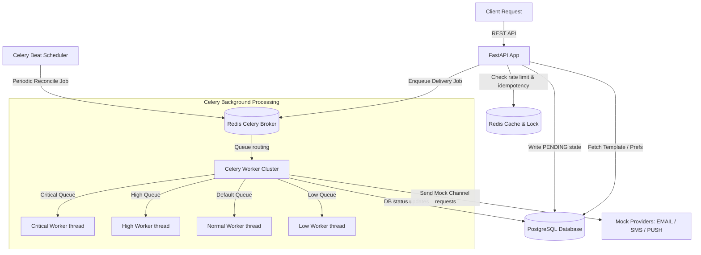
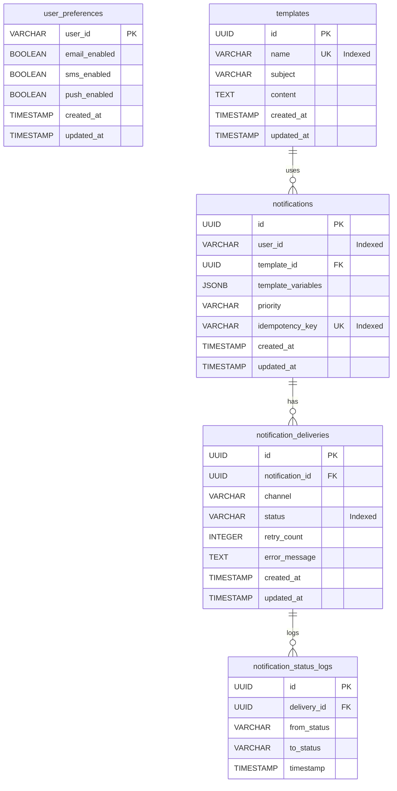

# System Design - Notification Service Backend

This document details the system design, database architecture, background queue execution pattern, reliability design, scalability considerations, and trade-offs made for the Notification Service backend.

---

## 1. System Architecture Diagram

---

## 2. Database Schema

The database is built on PostgreSQL using SQLAlchemy 2.0. Below is an explanation of each table:

### Entity Relationship Diagram (ERD)

### Table Explanations:
1. **`user_preferences`**: Tracks per-channel opt-in/opt-out status for each user. It features a primary key of `user_id` (representing the system's UUID or external system identifier). If a record is missing for a user, the service defaults to assuming the user is opted-in to all channels.
2. **`templates`**: Named, reusable messages with Jinja2-style placeholders. The template `name` is unique and indexed to ensure fast O(1) lookups during notification dispatch.
3. **`notifications`**: Stores the metadata of a notification request. It contains `user_id`, template links, resolved template variables, request priority, and optional `idempotency_key` (enforcing uniqueness constraint).
4. **`notification_deliveries`**: Tracks the delivery states for each channel targeted by a single notification. For example, if a notification is dispatched via `EMAIL` and `PUSH`, there will be 2 delivery rows.
5. **`notification_status_logs`**: Tracks state machine transitions. It provides a complete audit trail (e.g. `PENDING` -> `SENT` -> `DELIVERED` or `PENDING` -> `FAILED`) with timestamps for every delivery process.

---

## 3. Failure & Retry Handling

Delivery tasks are processed asynchronously inside the Celery worker cluster. If a transient error occurs during sending (e.g., simulated mock provider failure):
- **Exponential Backoff**: Tasks are automatically retried using a `4 ** retry_count` delay curve:
  - 1st attempt failure: Retries after $4^0 = 1$ second.
  - 2nd attempt failure: Retries after $4^1 = 4$ seconds.
  - 3rd attempt failure: Retries after $4^2 = 16$ seconds.
- **Max Retries**: The task will retry a maximum of 3 times. If all 3 attempts fail, the delivery status is transitioned to `FAILED`, and the final exception message is captured in `error_message`.
- **Reliability (Reconciliation)**:
  - When a notification is received by the web API, it is written to the DB in `PENDING` status *before* pushing to the task queue.
  - A Celery Beat periodic scheduler runs a reconciliation task every 5 minutes.
  - This task queries the DB for any delivery rows stuck in `PENDING` status for more than 5 minutes (indicating a worker crashed or queue connection failed) and pushes them back into their priority queues.

---

## 4. Scaling Plan (1,000+ notifications/sec)

To scale the service to high throughput:
- **Worker Scaling**: Workers can be horizontally scaled and grouped to consume specific queues (e.g., dedicated workers for `critical` and `high` queues to prevent lower-priority bulk messages from blocking time-sensitive transactional notifications).
- **Database Connection Pooling**: SQLAlchemy is configured with `pool_size=20` and `max_overflow=10` per worker/web instance to recycle and manage Postgres connections. In production, a pooling proxy like **pgBouncer** should be added to handle thousands of concurrent client connections.
- **Queue Sharding / Multi-Broker**: Redis can easily handle 1,000+ jobs/sec. Under severe scaling pressure, Redis can be sharded, or transitioned to RabbitMQ/Amazon SQS for robust priority handling.
- **Bottlenecks**: The primary bottleneck will be database write IOPS (for logging every transition) and database connection limits. Implementing bulk writes for status logs or buffering them using a cache could alleviate this.

---

## 5. Architectural Trade-offs & Decisions

### Queue: Celery vs. RQ
- **Decision**: Celery.
- **Rationale**: While RQ is lighter, Celery provides native support for delayed execution, task rate limits, and priority routing. It makes routing high-priority tasks to dedicated worker instances much simpler and cleaner.

### Rate Limiting: Sliding Window (ZSET) vs. Fixed Window (INCR)
- **Decision**: Redis Sorted Sets (ZSET) Sliding Window.
- **Rationale**: Fixed windows are vulnerable to request spikes at window boundaries. A sliding window ensures that the 100 requests/hour limit is strictly enforced within *any* 60-minute interval. ZSET is efficient, using $O(\log N + M)$ operations.

### Idempotency: Redis Locks vs. DB Unique Constraints
- **Decision**: Redis locks + cached done responses.
- **Rationale**: Storing idempotency keys with a TTL in Redis keeps the database hot path clear of transient locks. Using `NX=True` and a short TTL (120s) for in-progress operations prevents race conditions cleanly.
